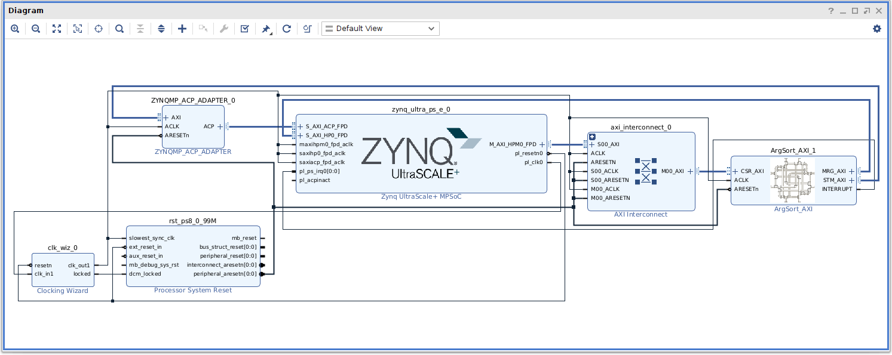

ArgSorter for Kv260
====================================================================================

Overvier
------------------------------------------------------------------------------------

### Requirement

* Board: any of the following
  - Kv260
* OS: any of the following
  - https://github.com/ikwzm/ZynqMP-FPGA-Linux
  - https://github.com/ikwzm/ZynqMP-FPGA-Ubuntu20.04

### Licensing

Distributed under the BSD 2-Clause License.


Design
------------------------------------------------------------------------------------

### Design Block



Fig.1 ArgSort-Kv260 Design Block

<br />

### Utilization

Table.2 Utilization

<table border="2">
  <tr>
    <td align="center" colspan="4">Design</td>
    <td align="center" colspan="5">Resources</td>
    <td align="center" rowspan="3">Freq<br />[MHz]</td>
  </tr>
  <tr>
    <td align="center" rowspan="2">Name</td>
    <td align="center" rowspan="2">MRG<br />WAYS</td>
    <td align="center" rowspan="2">MRG<br />WORDS</td>
    <td align="center" rowspan="2">STM<br />FB</td>
    <td align="center" colspan="2">CLB</td>
    <td align="center" colspan="2">BLOCK RAM</td>
    <td align="center" rowspan="2">DSPs</td>
  <tr>
    <td align="center">LUTs</td>
    <td align="center">Register</td>
    <td align="center">RAMB36</td>
    <td align="center">URAM</td>
  <tr>
    <td>argsort_16_1_0</td>
    <td align="center">16</td>
    <td align="center">1</td>
    <td align="center">0</td>
    <td align="right">37746</td>
    <td align="right">27256</td>
    <td align="right">38</td>
    <td align="right">0</td>
    <td align="right">0</td>
    <td align="center">250</td>
  </tr>
  <tr>
    <td>argsort_16_1_1</td>
    <td align="center">16</td>
    <td align="center">1</td>
    <td align="center">1</td>
    <td align="right">38994</td>
    <td align="right">27942</td>
    <td align="right">38</td>
    <td align="right">0</td>
    <td align="right">0</td>
    <td align="center">250</td>
  </tr>
  <tr>
    <td>argsort_16_1_2</td>
    <td align="center">16</td>
    <td align="center">1</td>
    <td align="center">2</td>
    <td align="right">37969</td>
    <td align="right">27092</td>
    <td align="right">54</td>
    <td align="right">0</td>
    <td align="right">0</td>
    <td align="center">250</td>
  </tr>
  <tr>
    <td>argsort_16_2_0</td>
    <td align="center">16</td>
    <td align="center">2</td>
    <td align="center">0</td>
    <td align="right">59579</td>
    <td align="right">55807</td>
    <td align="right">38</td>
    <td align="right">0</td>
    <td align="right">0</td>
    <td align="center">250</td>
  </tr>
  <tr>
    <td>argsort_16_2_1</td>
    <td align="center">16</td>
    <td align="center">2</td>
    <td align="center">1</td>
    <td align="right">60825</td>
    <td align="right">57091</td>
    <td align="right">38</td>
    <td align="right">0</td>
    <td align="right">0</td>
    <td align="center">250</td>
  </tr>
  <tr>
    <td>argsort_16_2_2</td>
    <td align="center">16</td>
    <td align="center">2</td>
    <td align="center">2</td>
    <td align="right">58764</td>
    <td align="right">55117</td>
    <td align="right">70</td>
    <td align="right">0</td>
    <td align="right">0</td>
    <td align="center">250</td>
  </tr>
  <tr>
    <td>argsort_32_1_0</td>
    <td align="center">32</td>
    <td align="center">1</td>
    <td align="center">0</td>
    <td align="right">65061</td>
    <td align="right">46392</td>
    <td align="right">70</td>
    <td align="right">0</td>
    <td align="right">15</td>
    <td align="center">250</td>
  </tr>
  <tr>
    <td>argsort_32_1_1</td>
    <td align="center">32</td>
    <td align="center">1</td>
    <td align="center">1</td>
    <td align="right">67923</td>
    <td align="right">47922</td>
    <td align="right">70</td>
    <td align="right">0</td>
    <td align="right">15</td>
    <td align="center">250</td>
  </tr>
  <tr>
    <td>argsort_32_1_2</td>
    <td align="center">32</td>
    <td align="center">1</td>
    <td align="center">2</td>
    <td align="right">66473</td>
    <td align="right">46318</td>
    <td align="right">70</td>
    <td align="right">32</td>
    <td align="right">15</td>
    <td align="center">250</td>
  </tr>
  <tr>
    <td>argsort_32_2_0</td>
    <td align="center">32</td>
    <td align="center">2</td>
    <td align="center">0</td>
    <td align="right">107350</td>
    <td align="right">103847</td>
    <td align="right">70</td>
    <td align="right">0</td>
    <td align="right">0</td>
    <td align="center">220</td>
  </tr>
  <tr>
    <td>argsort_32_2_1</td>
    <td align="center">32</td>
    <td align="center">2</td>
    <td align="center">1</td>
    <td align="right">109923</td>
    <td align="right">106646</td>
    <td align="right">70</td>
    <td align="right">0</td>
    <td align="right">0</td>
    <td align="center">220</td>
  </tr>
  <tr>
    <td>argsort_32_2_2</td>
    <td align="center">32</td>
    <td align="center">2</td>
    <td align="center">2</td>
    <td align="right">104040</td>
    <td align="right">102986</td>
    <td align="right">70</td>
    <td align="right">64</td>
    <td align="right">0</td>
    <td align="center">220</td>
  </tr>
  <tr>
    <td colspan="4">xck26-sfvc784-2LV-c resouce available</td>
    <td align="right">117120</td>
    <td align="right">234240</td>
    <td align="right">144</td>
    <td align="right">64</td>
    <td align="right">1248</td>
    <td align="center"></td>
  </tr>
</table>


<br />


")

Fig.2 Utlization(LUTs %)

<br />

### Performance

<table border="2">
  <tr>
    <td align="center" colspan="4">Design</td>
    <td align="center" colspan="3">Sort time [msec]</td>
    <td align="center" rowspan="2">Throughput <br />Average<br />[Mwords/sec]</td>
  </tr>
  <tr>
    <td align="center">Name</td>
    <td align="center">MRG<br />WAYS</td>
    <td align="center">MRG<br />WORDS</td>
    <td align="center">STM<br />FB</td>
    <td align="center">10K<br />[words]</td>
    <td align="center">100K<br />[words]</td>
    <td align="center">1M<br />[words]</td>
  <tr>
    <td>argsort_16_1_0</td>
    <td align="center">16</td>
    <td align="center">1</td>
    <td align="center">0</td>
    <td align="right">0.428</td>
    <td align="right">3.267</td>
    <td align="right">34.686</td>
    <td align="right">28.83</td>
  </tr>
  <tr>
    <td>argsort_16_1_1</td>
    <td align="center">16</td>
    <td align="center">1</td>
    <td align="center">1</td>
    <td align="right">0.350</td>
    <td align="right">2.386</td>
    <td align="right">22.1676</td>
    <td align="right">45.11</td>
  </tr>
  <tr>
    <td>argsort_16_1_2</td>
    <td align="center">16</td>
    <td align="center">1</td>
    <td align="center">2</td>
    <td align="right">0.343</td>
    <td align="right">2.265</td>
    <td align="right">21.265</td>
    <td align="right">47.03</td>
  </tr>
  <tr>
    <td>argsort_16_2_0</td>
    <td align="center">16</td>
    <td align="center">2</td>
    <td align="center">0</td>
    <td align="right">0.340</td>
    <td align="right">1.788</td>
    <td align="right">24.493</td>
    <td align="right">40.83</td>
  </tr>
  <tr>
    <td>argsort_16_2_1</td>
    <td align="center">16</td>
    <td align="center">2</td>
    <td align="center">1</td>
    <td align="right">0.267</td>
    <td align="right">1.196</td>
    <td align="right">16.887</td>
    <td align="right">59.22</td>
  </tr>
  <tr>
    <td>argsort_16_2_2</td>
    <td align="center">16</td>
    <td align="center">2</td>
    <td align="center">2</td>
    <td align="right">0.285</td>
    <td align="right">1.129</td>
    <td align="right">15.259</td>
    <td align="right">65.54</td>
  </tr>
  <tr>
    <td>argsort_32_1_0</td>
    <td align="center">32</td>
    <td align="center">1</td>
    <td align="center">0</td>
    <td align="right">0.329</td>
    <td align="right">2.304</td>
    <td align="right">24.744</td>
    <td align="right">40.41</td>
  </tr>
  <tr>
    <td>argsort_32_1_1</td>
    <td align="center">32</td>
    <td align="center">1</td>
    <td align="center">1</td>
    <td align="right">0.289</td>
    <td align="right">1.877</td>
    <td align="right">17.446</td>
    <td align="right">57.32</td>
  </tr>
  <tr>
    <td>argsort_32_1_2</td>
    <td align="center">32</td>
    <td align="center">1</td>
    <td align="center">2</td>
    <td align="right">0.544</td>
    <td align="right">2.157</td>
    <td align="right">19.901</td>
    <td align="right">50.25</td>
  </tr>
  <tr>
    <td>argsort_32_2_0</td>
    <td align="center">32</td>
    <td align="center">2</td>
    <td align="center">0</td>
    <td align="right">0.276</td>
    <td align="right">1.545</td>
    <td align="right">18.835</td>
    <td align="right">53.09</td>
  </tr>
  <tr>
    <td>argsort_32_2_1</td>
    <td align="center">32</td>
    <td align="center">2</td>
    <td align="center">1</td>
    <td align="right">0.231</td>
    <td align="right">1.332</td>
    <td align="right">13.847</td>
    <td align="right">72.22</td>
  </tr>
  <tr>
    <td>argsort_32_2_2</td>
    <td align="center">32</td>
    <td align="center">2</td>
    <td align="center">2</td>
    <td align="right">0.655</td>
    <td align="right">1.343</td>
    <td align="right">15.500</td>
    <td align="right">64.52</td>
  </tr>
  <tr>
    <td colspan="4">ZynqMP(arm64) numpy.argsort()</td>
    <td align="right">1.551</td>
    <td align="right">26.107</td>
    <td align="right">840.246</td>
    <td align="right">1.18</td>
  </tr>
</table>


<br />


![Fig.3 Throughput Average [Mwords/sec]](./doc/ja/argsort-kv260-performance.jpg "Fig.3 Throughput Average [Mwords/sec]")

Fig.3 Throughput Average [Mwords/sec]

<br />


Quick Start
------------------------------------------------------------------------------------

### Install

#### Install ZynqMP-FPGA-Linux or ZynqMP-FPGA-Ubuntu20.04

See the following URL:

* ZynqMP-FPGA-Linux
 - https://github.com/ikwzm/ZynqMP-FPGA-Linux/blob/v2021.1.1/doc/install/kv260.md
* ZynqMP-FPGA-Ubuntu20.04
 - https://github.com/ikwzm/ZynqMP-FPGA-Ubuntu20.04/blob/v2021.1-console-1/doc/install/kv260-console.md
 - https://github.com/ikwzm/ZynqMP-FPGA-Ubuntu20.04/blob/v2021.1-desktop-1/doc/install/kv260-desktop.md

#### Boot Kv260

#### Login fpga user

#### Download ArgSort-Kv260 to Kv260

```console
fpga@debian-fpga:~/$ git clone --branch 1.2.0 git://github.com/ikwzm/ArgSort-Kv260.git
fpga@debian-fpga:~/$ cd ArgSort-Kv260
```

#### Set TARGET to Rakefile.env

```console
fpga@debian-fpga:~/ArgSort-Kv260$ cat Rakefile.env
---
TARGET: argsort_32_2_1
```
Specify the base name of the Bitstream file you want to execute in place of TARGET:.

#### Set BASE_DTS to Rakefile.env (for ZynwMP-FPGA-Linux-Kernel-6.6)

```console
fpga@debian-fpga:~/ArgSort-Kv260$ cat Rakefile.env
---
TARGET: argsort_32_2_1
BASE_DTS: argsort_axi_v2.dts
```

The following changes have been made since ZynqMP-FPGA-Linux-Kernel-6.6(or later).

  * The node name of "fpga-full" has been changed to "fpga-region".
  * The fclk kernel driver is no longer built in by default.

so a new device tree is required.

#### Install Bitstream file to PL and Device Tree

```console
fpga@debian-fpga:~/ArgSort-Kv260$ sudo rake install
[sudo] password for fpga:
./dtbocfg.rb --install argsort --dts argsort_32_2_1_5.10.dts
<stdin>:27.16-32.20: Warning (unit_address_vs_reg): /fragment@2/__overlay__/uio_argsort: node has a reg or ranges property, but no unit name
<stdin>:18.13-52.5: Warning (avoid_unnecessary_addr_size): /fragment@2: unnecessary #address-cells/#size-cells without "ranges" or child "reg" property
[ 3617.061703] fpga_manager fpga0: writing argsort_32_2_1.bin to Xilinx ZynqMP FPGA Manager
[ 3617.538577] OF: overlay: WARNING: memory leak will occur if overlay removed, property: /fpga-full/firmware-name
[ 3617.561601] u-dma-buf udmabuf-argsort-in: driver version = 3.2.4
[ 3617.567613] u-dma-buf udmabuf-argsort-in: major number   = 243
[ 3617.573445] u-dma-buf udmabuf-argsort-in: minor number   = 0
[ 3617.579099] u-dma-buf udmabuf-argsort-in: phys address   = 0x0000000070100000
[ 3617.586234] u-dma-buf udmabuf-argsort-in: buffer size    = 33554432
[ 3617.592503] u-dma-buf amba_pl@0:udmabuf_argsort_in: driver installed.
[ 3617.608308] u-dma-buf udmabuf-argsort-out: driver version = 3.2.4
[ 3617.614407] u-dma-buf udmabuf-argsort-out: major number   = 243
[ 3617.620323] u-dma-buf udmabuf-argsort-out: minor number   = 1
[ 3617.626064] u-dma-buf udmabuf-argsort-out: phys address   = 0x0000000072100000
[ 3617.633277] u-dma-buf udmabuf-argsort-out: buffer size    = 33554432
[ 3617.639636] u-dma-buf amba_pl@0:udmabuf_argsort_out: driver installed.
[ 3617.682789] u-dma-buf udmabuf-argsort-tmp: driver version = 3.2.4
[ 3617.688883] u-dma-buf udmabuf-argsort-tmp: major number   = 243
[ 3617.694800] u-dma-buf udmabuf-argsort-tmp: minor number   = 2
[ 3617.700542] u-dma-buf udmabuf-argsort-tmp: phys address   = 0x0000000074100000
[ 3617.707761] u-dma-buf udmabuf-argsort-tmp: buffer size    = 134217728
[ 3617.714202] u-dma-buf amba_pl@0:udmabuf_argsort_tmp: driver installed.
```

If u-dma-buf device file permissions are not granted to the user, please give them permission.

```console
fpga@debian-fpga:~/ArgSort-Kv260$ ls -la /dev/udmabuf-argsort-*
crw------- 1 root root 243, 0 Mar 14 05:08 /dev/udmabuf-argsort-in
crw------- 1 root root 243, 1 Mar 14 05:08 /dev/udmabuf-argsort-out
crw------- 1 root root 243, 2 Mar 14 05:08 /dev/udmabuf-argsort-tmp
fpga@debian-fpga:~/ArgSort-Kv260$ sudo chmod o+rw /dev/udmabuf-argsort-*
fpga@debian-fpga:~/ArgSort-Kv260$ ls -la /dev/udmabuf-argsort-*
crw----rw- 1 root root 243, 0 Mar 14 05:08 /dev/udmabuf-argsort-in
crw----rw- 1 root root 243, 1 Mar 14 05:08 /dev/udmabuf-argsort-out
crw----rw- 1 root root 243, 2 Mar 14 05:08 /dev/udmabuf-argsort-tmp
```

#### Check Bitstream file installed to PL

```console
fpga@debian-fpga:~/ArgSort-Kv260$ rake info
python3 argsort_info.py
ArgSort_AXI Version      : 1.2
ArgSort_AXI Ways         : 32
ArgSort_AXI Words        : 2
ArgSort_AXI Feedback     : 1
ArgSort_AXI WordBits     : 32
ArgSort_AXI IndexBits    : 32
ArgSort_AXI Sort Order   : 0
ArgSort_AXI Sign Compare : 0
ArgSort_AXI Max Size     : 268435455
ArgSort_AXI Debug Enable : 1
```

#### Run test all

```console
fpga@debian-fpga:~/ArgSort-Kv260$ rake test_all
echo --- > argsort_32_2_1.log
python3 generate_sample.py --size 5000 --sample sample_0000005000.npy
generate_sample: sample_file : sample_0000005000.npy
generate_sample: size        : 5000
generate_sample: time        : 0.584 [msec]
python3 generate_expect.py --sample sample_0000005000.npy --expect expect_0000005000.npy --log expect.log
generate_expect: sample_file  : sample_0000005000.npy
generate_expect: expect_file  : expect_0000005000.npy
generate_expect: size         : 5000
generate_expect: average_time :    0.868 # [msec]
generate_expect: throughput   :    5.758 # [mwords/sec]
python3 argsort_test.py --sample sample_0000005000.npy --result result_0000005000.npy -n 10 -d 2 --log argsort_32_2_1.log
argsort_test   : Version      : 1.2
argsort_test   : Ways         : 32
argsort_test   : Words        : 2
argsort_test   : Feedback     : 1
argsort_test   : WordBits     : 32
argsort_test   : IndexBits    : 32
argsort_test   : Sort Order   : 0
argsort_test   : Sign Compare : 0
argsort_test   : Max Size     : 268435455
argsort_test   : Debug Enable : 1
argsort_test   : sample_file  : sample_0000005000.npy
argsort_test   : size         : 5000
argsort_test   : debug_mode   : 2
argsort_test   : loops        : 10
argsort_test   : time         :    0.290 # [msec]
argsort_test   : time         :    0.203 # [msec]
argsort_test   : time         :    0.194 # [msec]
argsort_test   : time         :    0.193 # [msec]
argsort_test   : time         :    0.194 # [msec]
argsort_test   : time         :    0.226 # [msec]
argsort_test   : time         :    0.194 # [msec]
argsort_test   : time         :    0.195 # [msec]
argsort_test   : time         :    0.194 # [msec]
argsort_test   : time         :    0.194 # [msec]
argsort_test   : result_file  : result_0000005000.npy
argsort_test   : average_time :    0.208 # [msec]
argsort_test   : throughput   :   24.094 # [mwords/sec]
argsort_test   : Debug_Time(0):    0.046 # [msec]
argsort_test   : Debug_Time(1):    0.030 # [msec]
argsort_test   : Debug_Time(2):    0.016 # [msec]
python3 check_result.py --sample sample_0000005000.npy --result result_0000005000.npy --expect expect_0000005000.npy
check_result: sample file : sample_0000005000.npy
check_result: expect file : expect_0000005000.npy
check_result: result file : result_0000005000.npy
check_result: OK
    :
    :
    :
python3 generate_expect.py --sample sample_0001000000.npy --expect expect_0001000000.npy --log expect.log
generate_expect: sample_file  : sample_0001000000.npy
generate_expect: expect_file  : expect_0001000000.npy
generate_expect: size         : 1000000
generate_expect: average_time :  839.076 # [msec]
generate_expect: throughput   :    1.192 # [mwords/sec]
python3 argsort_test.py --sample sample_0001000000.npy --result result_0001000000.npy -n 10 -d 2 --log argsort_32_2_1.log
argsort_test   : Version      : 1.2
argsort_test   : Ways         : 32
argsort_test   : Words        : 2
argsort_test   : Feedback     : 1
argsort_test   : WordBits     : 32
argsort_test   : IndexBits    : 32
argsort_test   : Sort Order   : 0
argsort_test   : Sign Compare : 0
argsort_test   : Max Size     : 268435455
argsort_test   : Debug Enable : 1
argsort_test   : sample_file  : sample_0001000000.npy
argsort_test   : size         : 1000000
argsort_test   : debug_mode   : 2
argsort_test   : loops        : 10
argsort_test   : time         :   13.931 # [msec]
argsort_test   : time         :   13.877 # [msec]
argsort_test   : time         :   13.888 # [msec]
argsort_test   : time         :   13.875 # [msec]
argsort_test   : time         :   13.870 # [msec]
argsort_test   : time         :   13.796 # [msec]
argsort_test   : time         :   13.894 # [msec]
argsort_test   : time         :   13.908 # [msec]
argsort_test   : time         :   13.908 # [msec]
argsort_test   : time         :   13.910 # [msec]
argsort_test   : result_file  : result_0001000000.npy
argsort_test   : average_time :   13.886 # [msec]
argsort_test   : throughput   :   72.017 # [mwords/sec]
argsort_test   : Debug_Time(0):   13.622 # [msec]
argsort_test   : Debug_Time(1):    8.104 # [msec]
argsort_test   : Debug_Time(2):    2.882 # [msec]
argsort_test   : Debug_Time(3):    2.637 # [msec]
python3 check_result.py --sample sample_0001000000.npy --result result_0001000000.npy --expect expect_0001000000.npy
check_result: sample file : sample_0001000000.npy
check_result: expect file : expect_0001000000.npy
check_result: result file : result_0001000000.npy
check_result: OK
```

Make sure all test results are OK.

#### Uninstall Bitstream file and Device Tree

```console
fpga@debian-fpga:~/ArgSort-Kv260$ sudo rake uninstall
[sudo] password for fpga:
./dtbocfg.rb --remove argsort
[ 4638.696910] u-dma-buf amba_pl@0:udmabuf_argsort_tmp: driver removed.
[ 4638.709041] u-dma-buf amba_pl@0:udmabuf_argsort_out: driver removed.
[ 4638.721107] u-dma-buf amba_pl@0:udmabuf_argsort_in: driver removed.
```

If you want to try another Bitstream file, be sure to uninstall the currently installed Bitstream file.


Build Bitstream file
------------------------------------------------------------------------------------

### Requirement

* Xilinx Vivado 2021.2

### Download ArgSort-Kv260

```console
shell$ git clone --branch 1.2.0 git://github.com/ikwzm/ArgSort-Kv260.git
shell$ cd ArgSort-Kv260
shell$ git submodule update --init --recursive
```

### Build argsort_32_2_1.bin

#### Create Project

```
Vivado > Tools > Run Tcl Script... > argsort_32_2_1/create_project.tcl
```

#### Implementation

```
Vivado > Tools > Run Tcl Script... > argsort_32_2_1/implementation.tcl
```

#### Convert from Bitstream File to Binary File

```console
vivado% cd argsort_32_2_1
vivado% bootgen -image design_1.bif -arch zynqmp -w -o ../argsort_32_2_1.bin
vivado% cd ..
```

#### Compress argsort_32_2_1.bin to argsort_32_2_1.bin.gz

```console
vivado% gzip argsort_32_2_1.bin
```

