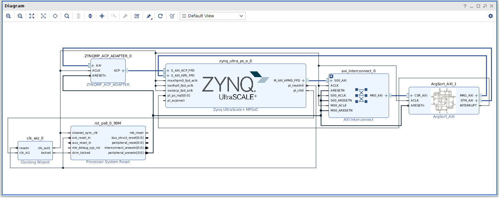

ArgSorter for Kv260
====================================================================================

Overvier
------------------------------------------------------------------------------------

### Requirement

* Board: any of the following
  - Kv260
* OS: any of the following
  - https://github.com/ikwzm/ZynqMP-FPGA-Debian13
  - https://github.com/ikwzm/ZynqMP-FPGA-Debian12

### Licensing

Distributed under the BSD 2-Clause License.


Design
------------------------------------------------------------------------------------

### Design Block



Fig.1 ArgSort-Kv260 Design Block

<br />

### Utilization

Table.2 Utilization

<table border="2">
  <tr>
    <td align="center" colspan="4">Design</td>
    <td align="center" colspan="5">Resources</td>
    <td align="center" rowspan="3">Freq<br />[MHz]</td>
  </tr>
  <tr>
    <td align="center" rowspan="2">Name</td>
    <td align="center" rowspan="2">MRG<br />WAYS</td>
    <td align="center" rowspan="2">MRG<br />WORDS</td>
    <td align="center" rowspan="2">STM<br />FB</td>
    <td align="center" colspan="2">CLB</td>
    <td align="center" colspan="2">BLOCK RAM</td>
    <td align="center" rowspan="2">DSPs</td>
  <tr>
    <td align="center">LUTs</td>
    <td align="center">Register</td>
    <td align="center">RAMB36</td>
    <td align="center">URAM</td>
  <tr>
    <td>argsort_16_1_0</td>
    <td align="center">16</td>
    <td align="center">1</td>
    <td align="center">0</td>
    <td align="right">38233</td>
    <td align="right">26731</td>
    <td align="right">38</td>
    <td align="right">0</td>
    <td align="right">0</td>
    <td align="center">250</td>
  </tr>
  <tr>
    <td>argsort_16_1_1</td>
    <td align="center">16</td>
    <td align="center">1</td>
    <td align="center">1</td>
    <td align="right">39478</td>
    <td align="right">27395</td>
    <td align="right">38</td>
    <td align="right">0</td>
    <td align="right">0</td>
    <td align="center">250</td>
  </tr>
  <tr>
    <td>argsort_16_1_2</td>
    <td align="center">16</td>
    <td align="center">1</td>
    <td align="center">2</td>
    <td align="right">38461</td>
    <td align="right">26572</td>
    <td align="right">54</td>
    <td align="right">0</td>
    <td align="right">0</td>
    <td align="center">250</td>
  </tr>
  <tr>
    <td>argsort_16_2_0</td>
    <td align="center">16</td>
    <td align="center">2</td>
    <td align="center">0</td>
    <td align="right">59402</td>
    <td align="right">55429</td>
    <td align="right">38</td>
    <td align="right">0</td>
    <td align="right">0</td>
    <td align="center">250</td>
  </tr>
  <tr>
    <td>argsort_16_2_1</td>
    <td align="center">16</td>
    <td align="center">2</td>
    <td align="center">1</td>
    <td align="right">60713</td>
    <td align="right">56885</td>
    <td align="right">38</td>
    <td align="right">0</td>
    <td align="right">0</td>
    <td align="center">250</td>
  </tr>
  <tr>
    <td>argsort_16_2_2</td>
    <td align="center">16</td>
    <td align="center">2</td>
    <td align="center">2</td>
    <td align="right">58661</td>
    <td align="right">54993</td>
    <td align="right">70</td>
    <td align="right">0</td>
    <td align="right">0</td>
    <td align="center">250</td>
  </tr>
  <tr>
    <td>argsort_32_1_0</td>
    <td align="center">32</td>
    <td align="center">1</td>
    <td align="center">0</td>
    <td align="right">66475</td>
    <td align="right">45702</td>
    <td align="right">70</td>
    <td align="right">0</td>
    <td align="right">15</td>
    <td align="center">250</td>
  </tr>
  <tr>
    <td>argsort_32_1_1</td>
    <td align="center">32</td>
    <td align="center">1</td>
    <td align="center">1</td>
    <td align="right">69083</td>
    <td align="right">47209</td>
    <td align="right">70</td>
    <td align="right">0</td>
    <td align="right">15</td>
    <td align="center">250</td>
  </tr>
  <tr>
    <td>argsort_32_1_2</td>
    <td align="center">32</td>
    <td align="center">1</td>
    <td align="center">2</td>
    <td align="right">67880</td>
    <td align="right">45818</td>
    <td align="right">70</td>
    <td align="right">32</td>
    <td align="right">15</td>
    <td align="center">250</td>
  </tr>
  <tr>
    <td>argsort_32_2_0</td>
    <td align="center">32</td>
    <td align="center">2</td>
    <td align="center">0</td>
    <td align="right">106874</td>
    <td align="right">103345</td>
    <td align="right">70</td>
    <td align="right">0</td>
    <td align="right">0</td>
    <td align="center">220</td>
  </tr>
  <tr>
    <td>argsort_32_2_1</td>
    <td align="center">32</td>
    <td align="center">2</td>
    <td align="center">1</td>
    <td align="right">109377</td>
    <td align="right">106233</td>
    <td align="right">70</td>
    <td align="right">0</td>
    <td align="right">0</td>
    <td align="center">220</td>
  </tr>
  <tr>
    <td>argsort_32_2_2</td>
    <td align="center">32</td>
    <td align="center">2</td>
    <td align="center">2</td>
    <td align="right">105601</td>
    <td align="right">102625</td>
    <td align="right">70</td>
    <td align="right">64</td>
    <td align="right">0</td>
    <td align="center">220</td>
  </tr>
  <tr>
    <td colspan="4">xck26-sfvc784-2LV-c resouce available</td>
    <td align="right">117120</td>
    <td align="right">234240</td>
    <td align="right">144</td>
    <td align="right">64</td>
    <td align="right">1248</td>
    <td align="center"></td>
  </tr>
</table>


<br />


")

Fig.2 Utlization(LUTs %)

<br />

### Performance

<table border="2">
  <tr>
    <td align="center" colspan="4">Design</td>
    <td align="center" colspan="3">Sort time [msec]</td>
    <td align="center" rowspan="2">Throughput <br />Average<br />[Mwords/sec]</td>
  </tr>
  <tr>
    <td align="center">Name</td>
    <td align="center">MRG<br />WAYS</td>
    <td align="center">MRG<br />WORDS</td>
    <td align="center">STM<br />FB</td>
    <td align="center">10K<br />[words]</td>
    <td align="center">100K<br />[words]</td>
    <td align="center">1M<br />[words]</td>
  <tr>
    <td>argsort_16_1_0</td>
    <td align="center">16</td>
    <td align="center">1</td>
    <td align="center">0</td>
    <td align="right">0.452</td>
    <td align="right">3.696</td>
    <td align="right">34.947</td>
    <td align="right">28.61</td>
  </tr>
  <tr>
    <td>argsort_16_1_1</td>
    <td align="center">16</td>
    <td align="center">1</td>
    <td align="center">1</td>
    <td align="right">0.363</td>
    <td align="right">2.394</td>
    <td align="right">22.170</td>
    <td align="right">45.11</td>
  </tr>
  <tr>
    <td>argsort_16_1_2</td>
    <td align="center">16</td>
    <td align="center">1</td>
    <td align="center">2</td>
    <td align="right">0.369</td>
    <td align="right">2.294</td>
    <td align="right">21.265</td>
    <td align="right">47.03</td>
  </tr>
  <tr>
    <td>argsort_16_2_0</td>
    <td align="center">16</td>
    <td align="center">2</td>
    <td align="center">0</td>
    <td align="right">0.347</td>
    <td align="right">2.203</td>
    <td align="right">24.540</td>
    <td align="right">40.75</td>
  </tr>
  <tr>
    <td>argsort_16_2_1</td>
    <td align="center">16</td>
    <td align="center">2</td>
    <td align="center">1</td>
    <td align="right">0.288</td>
    <td align="right">1.358</td>
    <td align="right">16.992</td>
    <td align="right">58.85</td>
  </tr>
  <tr>
    <td>argsort_16_2_2</td>
    <td align="center">16</td>
    <td align="center">2</td>
    <td align="center">2</td>
    <td align="right">0.304</td>
    <td align="right">1.285</td>
    <td align="right">15.299</td>
    <td align="right">65.36</td>
  </tr>
  <tr>
    <td>argsort_32_1_0</td>
    <td align="center">32</td>
    <td align="center">1</td>
    <td align="center">0</td>
    <td align="right">0.352</td>
    <td align="right">2.523</td>
    <td align="right">24.887</td>
    <td align="right">40.18</td>
  </tr>
  <tr>
    <td>argsort_32_1_1</td>
    <td align="center">32</td>
    <td align="center">1</td>
    <td align="center">1</td>
    <td align="right">0.309</td>
    <td align="right">1.919</td>
    <td align="right">17.509</td>
    <td align="right">57.11</td>
  </tr>
  <tr>
    <td>argsort_32_1_2</td>
    <td align="center">32</td>
    <td align="center">1</td>
    <td align="center">2</td>
    <td align="right">0.581</td>
    <td align="right">2.345</td>
    <td align="right">19.922</td>
    <td align="right">50.20</td>
  </tr>
  <tr>
    <td>argsort_32_2_0</td>
    <td align="center">32</td>
    <td align="center">2</td>
    <td align="center">0</td>
    <td align="right">0.293</td>
    <td align="right">1.840</td>
    <td align="right">18.986</td>
    <td align="right">52.67</td>
  </tr>
  <tr>
    <td>argsort_32_2_1</td>
    <td align="center">32</td>
    <td align="center">2</td>
    <td align="center">1</td>
    <td align="right">0.254</td>
    <td align="right">1.277</td>
    <td align="right">13.868</td>
    <td align="right">72.11</td>
  </tr>
  <tr>
    <td>argsort_32_2_2</td>
    <td align="center">32</td>
    <td align="center">2</td>
    <td align="center">2</td>
    <td align="right">0.637</td>
    <td align="right">1.673</td>
    <td align="right">15.504</td>
    <td align="right">64.50</td>
  </tr>
  <tr>
    <td colspan="4">ZynqMP(arm64) numpy.argsort()</td>
    <td align="right">1.758</td>
    <td align="right">27.959</td>
    <td align="right">851.644</td>
    <td align="right">1.17</td>
  </tr>
</table>


<br />


![Fig.3 Throughput Average [Mwords/sec]](./doc/ja/argsort-kv260-performance.jpg "Fig.3 Throughput Average [Mwords/sec]")

Fig.3 Throughput Average [Mwords/sec]

<br />


Quick Start
------------------------------------------------------------------------------------

### Install

#### Install ZynqMP-FPGA-Debian13 or ZynqMP-FPGA-Debian12

See the following URL:

* ZynqMP-FPGA-Debian13
 - https://github.com/ikwzm/ZynqMP-FPGA-Debian13/blob/v3.1.0/doc/install/kv260.md
* ZynqMP-FPGA-Debian12
 - https://github.com/ikwzm/ZynqMP-FPGA-Debian12/blob/v7.0.0/doc/install/kv260.md

#### Boot Kv260

#### Login fpga user

#### Download ArgSort-Kv260 to Kv260

```console
fpga@debian-fpga:~/$ git clone --branch 1.7.0 git://github.com/ikwzm/ArgSort-Kv260.git
fpga@debian-fpga:~/$ cd ArgSort-Kv260
```

#### Set TARGET to Rakefile.env

```console
fpga@debian-fpga:~/ArgSort-Kv260$ cat Rakefile.env
---
TARGET: argsort_32_2_1
```
Specify the base name of the Bitstream file you want to execute in place of TARGET:.

#### Set BASE_DTS to Rakefile.env (for ZynwMP-FPGA-Linux-Kernel-6.6)

```console
fpga@debian-fpga:~/ArgSort-Kv260$ cat Rakefile.env
---
TARGET: argsort_32_2_1
BASE_DTS: argsort_axi_v2.dts
```

The following changes have been made since ZynqMP-FPGA-Linux-Kernel-6.6(or later).

  * The node name of "fpga-full" has been changed to "fpga-region".
  * The fclk kernel driver is no longer built in by default.

so a new device tree is required.

#### Install Bitstream file to PL and Device Tree

```console
fpga@debian-fpga:~/ArgSort-Kv260$ sudo rake install
[sudo] password for fpga:
./dtbocfg.rb --install argsort --dts argsort_32_2_1_5.10.dts
<stdin>:27.16-32.20: Warning (unit_address_vs_reg): /fragment@2/__overlay__/uio_argsort: node has a reg or ranges property, but no unit name
<stdin>:18.13-52.5: Warning (avoid_unnecessary_addr_size): /fragment@2: unnecessary #address-cells/#size-cells without "ranges" or child "reg" property
[ 3617.061703] fpga_manager fpga0: writing argsort_32_2_1.bin to Xilinx ZynqMP FPGA Manager
[ 3617.538577] OF: overlay: WARNING: memory leak will occur if overlay removed, property: /fpga-full/firmware-name
[ 3617.561601] u-dma-buf udmabuf-argsort-in: driver version = 3.2.4
[ 3617.567613] u-dma-buf udmabuf-argsort-in: major number   = 243
[ 3617.573445] u-dma-buf udmabuf-argsort-in: minor number   = 0
[ 3617.579099] u-dma-buf udmabuf-argsort-in: phys address   = 0x0000000070100000
[ 3617.586234] u-dma-buf udmabuf-argsort-in: buffer size    = 33554432
[ 3617.592503] u-dma-buf amba_pl@0:udmabuf_argsort_in: driver installed.
[ 3617.608308] u-dma-buf udmabuf-argsort-out: driver version = 3.2.4
[ 3617.614407] u-dma-buf udmabuf-argsort-out: major number   = 243
[ 3617.620323] u-dma-buf udmabuf-argsort-out: minor number   = 1
[ 3617.626064] u-dma-buf udmabuf-argsort-out: phys address   = 0x0000000072100000
[ 3617.633277] u-dma-buf udmabuf-argsort-out: buffer size    = 33554432
[ 3617.639636] u-dma-buf amba_pl@0:udmabuf_argsort_out: driver installed.
[ 3617.682789] u-dma-buf udmabuf-argsort-tmp: driver version = 3.2.4
[ 3617.688883] u-dma-buf udmabuf-argsort-tmp: major number   = 243
[ 3617.694800] u-dma-buf udmabuf-argsort-tmp: minor number   = 2
[ 3617.700542] u-dma-buf udmabuf-argsort-tmp: phys address   = 0x0000000074100000
[ 3617.707761] u-dma-buf udmabuf-argsort-tmp: buffer size    = 134217728
[ 3617.714202] u-dma-buf amba_pl@0:udmabuf_argsort_tmp: driver installed.
```

If u-dma-buf device file permissions are not granted to the user, please give them permission.

```console
fpga@debian-fpga:~/ArgSort-Kv260$ ls -la /dev/udmabuf-argsort-*
crw------- 1 root root 243, 0 Mar 14 05:08 /dev/udmabuf-argsort-in
crw------- 1 root root 243, 1 Mar 14 05:08 /dev/udmabuf-argsort-out
crw------- 1 root root 243, 2 Mar 14 05:08 /dev/udmabuf-argsort-tmp
fpga@debian-fpga:~/ArgSort-Kv260$ sudo chmod o+rw /dev/udmabuf-argsort-*
fpga@debian-fpga:~/ArgSort-Kv260$ ls -la /dev/udmabuf-argsort-*
crw----rw- 1 root root 243, 0 Mar 14 05:08 /dev/udmabuf-argsort-in
crw----rw- 1 root root 243, 1 Mar 14 05:08 /dev/udmabuf-argsort-out
crw----rw- 1 root root 243, 2 Mar 14 05:08 /dev/udmabuf-argsort-tmp
```

#### Check Bitstream file installed to PL

```console
fpga@debian-fpga:~/ArgSort-Kv260$ rake info
python3 argsort_info.py
ArgSort_AXI Version      : 1.7
ArgSort_AXI Ways         : 32
ArgSort_AXI Words        : 2
ArgSort_AXI Feedback     : 1
ArgSort_AXI WordBits     : 32
ArgSort_AXI IndexBits    : 32
ArgSort_AXI Sort Order   : 0
ArgSort_AXI Sign Compare : 0
ArgSort_AXI Max Size     : 268435455
ArgSort_AXI Debug Enable : 1
```

#### Run test all

```console
fpga@debian-fpga:~/ArgSort-Kv260$ rake test_all
echo --- > argsort_32_2_1.log
python3 generate_sample.py --size 5000 --sample sample_0000005000.npy
generate_sample: sample_file : sample_0000005000.npy
generate_sample: size        : 5000
generate_sample: time        : 0.584 [msec]
python3 generate_expect.py --sample sample_0000005000.npy --expect expect_0000005000.npy --log expect.log
generate_expect: sample_file  : sample_0000005000.npy
generate_expect: expect_file  : expect_0000005000.npy
generate_expect: size         : 5000
generate_expect: average_time :    5.710 # [msec]
generate_expect: throughput   :    0.876 # [mwords/sec]
python3 argsort_test.py --sample sample_0000005000.npy --result result_0000005000.npy -n 10 -d 2 --log argsort_32_2_1.log 
argsort_test   : Version      : 1.7
argsort_test   : Ways         : 32
argsort_test   : Words        : 2
argsort_test   : Feedback     : 1
argsort_test   : WordBits     : 32
argsort_test   : IndexBits    : 32
argsort_test   : Sort Order   : 0
argsort_test   : Sign Compare : 0
argsort_test   : Max Size     : 268435455
argsort_test   : Debug Enable : 1
argsort_test   : sample_file  : sample_0000005000.npy
argsort_test   : size         : 5000
argsort_test   : debug_mode   : 2
argsort_test   : loops        : 10
argsort_test   : time         :    0.281 # [msec]
argsort_test   : time         :    0.190 # [msec]
argsort_test   : time         :    0.184 # [msec]
argsort_test   : time         :    0.184 # [msec]
argsort_test   : time         :    0.184 # [msec]
argsort_test   : time         :    0.182 # [msec]
argsort_test   : time         :    0.180 # [msec]
argsort_test   : time         :    0.197 # [msec]
argsort_test   : time         :    0.168 # [msec]
argsort_test   : time         :    0.165 # [msec]
argsort_test   : result_file  : result_0000005000.npy
argsort_test   : average_time :    0.191 # [msec]
argsort_test   : throughput   :   26.120 # [mwords/sec]
argsort_test   : Debug_Time(0):    0.100 # [msec]
argsort_test   : Debug_Time(1):    0.066 # [msec]
argsort_test   : Debug_Time(2):    0.034 # [msec]
python3 check_result.py --sample sample_0000005000.npy --result result_0000005000.npy --expect expect_0000005000.npy
check_result: sample file : sample_0000005000.npy
check_result: expect file : expect_0000005000.npy
check_result: result file : result_0000005000.npy
check_result: OK
    :
    :
    :
python3 generate_expect.py --sample sample_0001000000.npy --expect expect_0001000000.npy --log expect.log
generate_expect: sample_file  : sample_0001000000.npy
generate_expect: expect_file  : expect_0001000000.npy
generate_expect: size         : 1000000
generate_expect: average_time :  849.691 # [msec]
generate_expect: throughput   :    1.177 # [mwords/sec]
python3 argsort_test.py --sample sample_0001000000.npy --result result_0001000000.npy -n 10 -d 2 --log argsort_32_2_1.log 
argsort_test   : Version      : 1.7
argsort_test   : Ways         : 32
argsort_test   : Words        : 2
argsort_test   : Feedback     : 1
argsort_test   : WordBits     : 32
argsort_test   : IndexBits    : 32
argsort_test   : Sort Order   : 0
argsort_test   : Sign Compare : 0
argsort_test   : Max Size     : 268435455
argsort_test   : Debug Enable : 1
argsort_test   : sample_file  : sample_0001000000.npy
argsort_test   : size         : 1000000
argsort_test   : debug_mode   : 2
argsort_test   : loops        : 10
argsort_test   : time         :   14.034 # [msec]
argsort_test   : time         :   13.845 # [msec]
argsort_test   : time         :   13.832 # [msec]
argsort_test   : time         :   13.924 # [msec]
argsort_test   : time         :   13.716 # [msec]
argsort_test   : time         :   13.852 # [msec]
argsort_test   : time         :   13.858 # [msec]
argsort_test   : time         :   13.855 # [msec]
argsort_test   : time         :   13.869 # [msec]
argsort_test   : time         :   13.839 # [msec]
argsort_test   : result_file  : result_0001000000.npy
argsort_test   : average_time :   13.862 # [msec]
argsort_test   : throughput   :   72.138 # [mwords/sec]
argsort_test   : Debug_Time(0):   29.925 # [msec]
argsort_test   : Debug_Time(1):   17.764 # [msec]
argsort_test   : Debug_Time(2):    6.324 # [msec]
argsort_test   : Debug_Time(3):    5.837 # [msec]
python3 check_result.py --sample sample_0001000000.npy --result result_0001000000.npy --expect expect_0001000000.npy
check_result: sample file : sample_0001000000.npy
check_result: expect file : expect_0001000000.npy
check_result: result file : result_0001000000.npy
check_result: OK
```

Make sure all test results are OK.

#### Uninstall Bitstream file and Device Tree

```console
fpga@debian-fpga:~/ArgSort-Kv260$ sudo rake uninstall
[sudo] password for fpga:
./dtbocfg.rb --remove argsort
[ 4638.696910] u-dma-buf amba_pl@0:udmabuf_argsort_tmp: driver removed.
[ 4638.709041] u-dma-buf amba_pl@0:udmabuf_argsort_out: driver removed.
[ 4638.721107] u-dma-buf amba_pl@0:udmabuf_argsort_in: driver removed.
```

If you want to try another Bitstream file, be sure to uninstall the currently installed Bitstream file.


Build Bitstream file
------------------------------------------------------------------------------------

### Requirement

* Xilinx Vivado 2021.2 or 2023.1 or 2025.1

### Download ArgSort-Kv260

```console
shell$ git clone --branch 1.7.0 git://github.com/ikwzm/ArgSort-Kv260.git
shell$ cd ArgSort-Kv260
shell$ git submodule update --init --recursive
```

### Build argsort_32_2_1.bin

#### Create Project

```
Vivado > Tools > Run Tcl Script... > argsort_32_2_1/create_project.tcl
```

#### Implementation

```
Vivado > Tools > Run Tcl Script... > argsort_32_2_1/implementation.tcl
```

#### Convert from Bitstream File to Binary File

```console
vivado% cd argsort_32_2_1
vivado% bootgen -image design_1.bif -arch zynqmp -w -o ../argsort_32_2_1.bin
vivado% cd ..
```

#### Compress argsort_32_2_1.bin to argsort_32_2_1.bin.gz

```console
vivado% gzip argsort_32_2_1.bin
```

